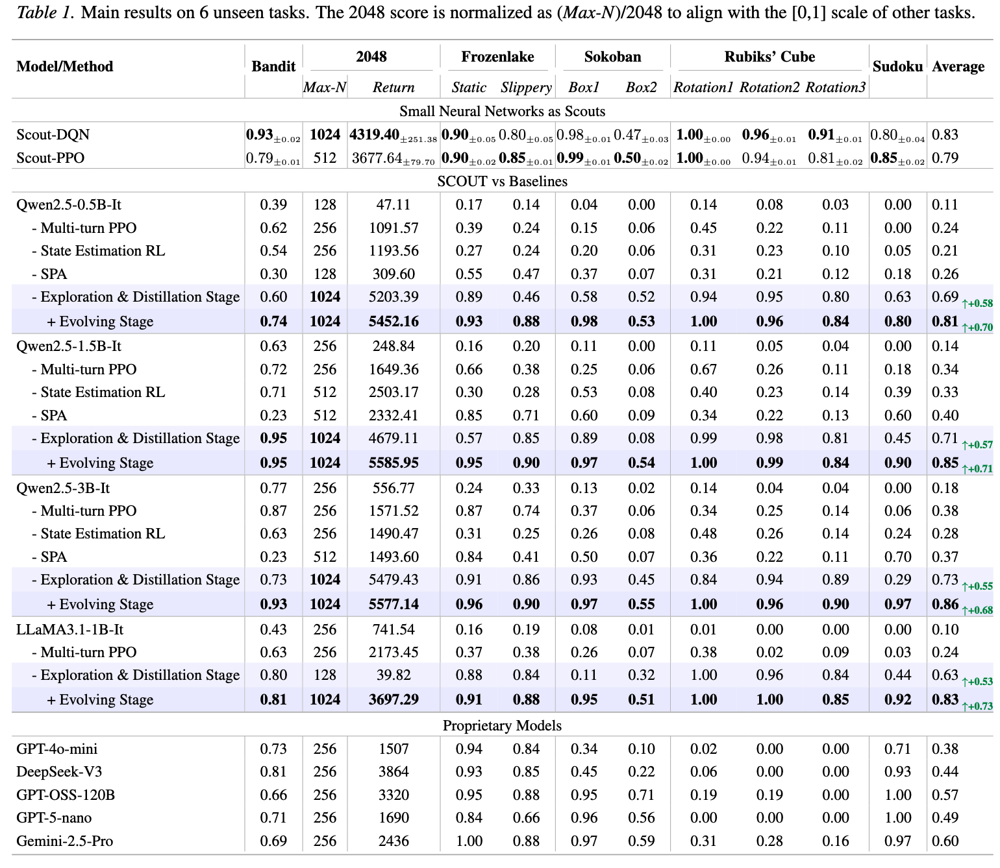

<h1 align="center"> SCOUT: Language-based Trial and Error Fails in the Era of Experience </h1>

<p align="center">
  <strong>Sub-Scale Collaboration On Unseen Task (SCOUT)</strong><br>
  <em>Decoupling Exploration from Exploitation for Efficient LLM Agent Training</em>
</p>

<p align="center">
  <a href="https://scout-cs.github.io/"></a>
  <a href=""></a>
  <a href="https://github.com/Harry-mic/SCOUT"></a>
  <a href=""></a>
  <a href=""></a>
</p>

## 📖 Overview

**SCOUT** is a novel framework that addresses the inefficiency of Large Language Models (LLMs) in exploring unseen, non-linguistic environments (e.g., symbolic or spatial tasks).

While LLMs excel at exploitation (reasoning based on knowledge), they are computationally expensive and inefficient at exploration (trial-and-error). SCOUT decouples these two processes:
1.  **Lightweight Scouts:** Use small networks (MLPs/CNNs) to rapidly master environmental dynamics via standard RL.
2.  **Sub-Scale Collaboration:** Distill the scout's expert trajectories into the LLM via SFT.
3.  **Evolution:** Activate the LLM's latent world knowledge through multi-turn RL (PPO).

Empirically, SCOUT enables a **Qwen2.5-3B** model to achieve an average score of **0.86** on complex tasks (including Rubik's Cube and 2048), significantly performing proprietary models like **Gemini-2.5-Pro (0.60)**, while reducing GPU hours by **~60%**.

This repository is built upon the [RAGEN](https://github.com/RAGEN-AI/RAGEN) framework.

## 🚀 The SCOUT Framework

<p align="center"></p>

The training pipeline consists of three distinct stages:

1.  **Exploration Stage (Scout Training):**
    * Agents: Small MLPs or CNNs ($~10^{-5}$B parameters).
    * Algorithm: DQN or PPO.
    * Goal: Efficiently map transition dynamics and generate expert trajectories ($\tau_{scout}$).

2.  **Distillation Stage (SFT):**
    * Process: Transform $\tau_{scout}$ into text-based dialogue formats using a deterministic *Textualizer*.
    * Goal: "Warm up" the LLM to understand the physics of the unseen task.

3.  **Evolving Stage (Multi-turn RL):**
    * Algorithm: Multi-turn PPO (via RAGEN).
    * Goal: Refine reasoning and enable the LLM to self-evolve beyond the scout's capabilities.

## 🛠️ Installation

```bash
# Clone the repository
git clone https://github.com/Harry-mic/SCOUT.git
cd SCOUT

# Setup the environment (based on RAGEN)
bash scripts/setup_ragen.sh
```

## 🎮 **Environments**

We introduce several OOD (Out-of-Distribution) symbolic and spatial tasks:

Rubik's Cube: Restore a 2x2 scrambled cube (spatial reasoning).

2048: Long-horizon planning (>800 turns).

Sudoku: Logic-based constraint satisfaction.

Sokoban: Box-pushing planning task.

FrozenLake: Stochastic navigation (Static & Slippery variants).

Bandit: Fundamental RL benchmark.


## ⚡ Usage

### 1. Exploration Stage (Train Scouts)
Train lightweight scouts (MLP/CNN) to collect expert trajectories.
```bash
# Example: Train a DQN scout for Frozenlake and collected the trajectories as runs_scouts
python scout_dqn/dqn_frozenlake.py --track
```

### 2. Distillation Stage (SFT)
Textualizer the collected datasets.
```bash
# Textualizer from one-hot vectors to language dialogues.
python scripts/Textualizer_frozenlake.py  runs_scouts/Frozenlake_dqn_*** --step step_***
```
Fine-tune the base LLM on the collected trajectories. We utilize LLaMA-Factory for this stage.
```bash
# Run SFT on previous collected dialogues.
llama-factory train xxx.yaml
```

### 3. Evolving Stage (Multi-turn RL)
Run multi-turn PPO on the SFT model using the RAGEN infrastructure.

Start Training:

```bash
bash scripts/example_bash.sh
```

## 📊 Performance
*SCOUT achieves state-of-the-art performance on unseen tasks while saving 60% of computational costs compared to direct RL training.*
<p align="center"></p>

## 📂 Repository Structure

```text
SCOUT/
├── ragen/                  # Core RAGEN framework (Env Manager, Context Manager)
├── scout_dqn/              # Lightweight scout training (DQN) & Textualizers
├── config/                 # Hydra configurations for PPO/GRPO
├── scripts/                # Setup and utility scripts
└── train.py                # Main entry point for Evolving Stage
```

## 📜 Citation
If you find SCOUT useful for your research, please cite our paper:

```text
@article{scout2026,
  title={Language-based Trial and Error Fails in the Era of Experience},
  author={Anonymous Authors},
  journal={Under Review at ICML},
  year={2026}
}
```
## Acknowledgements
This codebase is built upon RAGEN. We thank the RAGEN team for their infrastructure support.
